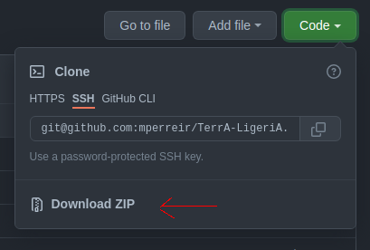

# Herbier intéractif, immersif

## Présentation

**Groupe 4 - Botanique, Distance - Projection**

| **EDNA**           | **Polytech**   |
|--------------------|----------------|
| Elise Croguennoc   | Antoine Zuber  |
| Juliette Rosenbaum | Antoine Eluere |
| Marie Sambron      | Houssem Kacemi |
| Owen Schneider     | Iheb Landoulsi |
| Paul Maurin        | -              |
| Sophie Lambert     | -              |

## Introduction

Cette documentation indique l'essentiel de ce qu'il faut savoir pour pouvoir reproduire le projet developpé pour le
TerrA-LigeriA. L'ensemble du code officiel pour tous les projets est tenu par un professeur de
Polytech Nantes : https://github.com/mperreir/TerrA-LigeriA .

Le lien du groupe sur lequel ont a pu developper est celui ci : https://github.com/Antoine-Zuber/TerrA-LigeriA . C'est
un fork (une branche parallèle en quelque sorte) qui sera ensuite refusionné avec l'original.

##Récupération des fichiers
### 1. Téléchargement
 * ####  Via récupération du fichier zip
    La récupération du code source se fait en téléchargeant ce [fichier zip](https://github.com/Antoine-Zuber/TerrA-LigeriA/archive/refs/heads/main.zip) (Accessible aussi via la page github du projet (voir [lien](https://github.com/Antoine-Zuber/TerrA-LigeriA)) en cliquant sur le bouton **Code** (voir photo ci-dessous).

    
   
    Une fois le fichier téléchargé, décompressez-le (Sous Windows: `CLIQUE DROIT` > Extraire tout)

* #### Via Git
    Si vous êtes familier avec l'utilisation de git, vous pouvez cloner le projet via la commande suivante:

    ```git clone https://github.com/Antoine-Zuber/TerrA-LigeriA```

### 2. Trouver le bon répertoire
Le dossier contenant ce projet est accessible via le chemin suivant:  [museum-botanique/groupe-4](.) et suis l'arborescence suivante :
```
groupe-4
├───data .......................... Dossier contenant les visuels & sons correspondant aux différentes plantes
│   ├───0-Sommaire
│   ├───1-BERBERIS_EMPETRIFOLIA     
│   │   └───infos
│   ├───2-DELPHINIUM_STAPHISAGRIA
│   │   └───infos
│   ├───3-BERBERIS_ARISTATA
│   │   └───infos
│   ├───4-RANUNCULUS_FICARIA
│   │   └───infos
│   ├───5-AKEBIA_QUINATA
│   │   └───infos
│   ├───env
│   └───sons
├───example_leap .................. Dossier contenant des fichiers javascript de test du Leap Motion
├───img-doc
├───lib ........................... Dossier contenant les libraires utilisées                    
└───src ........................... Dossier contenant les fichiers source du projet
    ├───css
    └───js
```
## Installation && Mise en place
### Prérequis materiels
 * Leap motion controller - Dispositif de hand tracking
 * Ordinateur portable - Contrôle tous les dispositifs utilisés. 1x HDMi, 2x USB type B, 1x Sortie audio.
 * Projecteur principale: Ce projecteur  lié au pc par un cable HDMI permet d’afficher l’image réel de la plante sur la tulle et le gif qui représente l'environnement de la plante
 * Projecteur secondaire: Ce projecteur est lié par un câble usb. Il permet d’afficher les informations contenues  dans l’herbier.
 * Haut-parleurs: ils sont utilisés pour créer une ambiance compatible avec les plantes.

    
### Leap Motion
* #### Windows
    1. Télécharger Leap SDK [ici](https://developer-archive.leapmotion.com/downloads/external/v4-1-hand-tracking/windows?version=4.1.0).
    2. Lancer l'installeur et suivez les instructions.
    3. Une fois l'installation terminée, chercher "**Leap Motion Control Panel**" dans la barre de recherche et executez-le.
* #### Ubuntu
  1. Télécharger Leap SDK [ici](https://www2.leapmotion.com/v2-developer-beta-linux)
  2. Décompresser **Leap_Motion_SDK_Linux_x.x.x.tgz**
  3. Installer le paquet via la commande suivante :
     * Pour les systèmes 32-bit : ```sudo dpkg --install Leap-version-x86.deb```
     * Pour les systèmes 64-bit : ```sudo dpkg --install Leap-version-x64.deb```
  4. Brancher le Leap Motion en USB.
  5. Sur Ubuntu, ouvrir un terminal et executer la commande suivante :```sudo leapd;```. Si tout se passe bien, les LEDs du capteur devrais s'allumées.
  
### Projet

1. Accéder à **[museum-botanique/groupe-4](.)** 
2. Pour tester le bon fonctionnement du Leap Motion, executer **[threejs-bones.html](example_leap/EX2-threejs-bones.html)** (situés dans le dossier **[example_leap](example_leap)**)
3. Ouvrir (Double-clique) les fichiers **[VueVivant.html](src/VueVivant.html)** et **[VueHerbier.html](src/VueHerbier.html)** (situés dans le dossier **[src](src)**) dans un navigateur.\
    Les deux fichiers doivent chacun être ouvert dans une fenêtre de navigateur différente placée chacune sur une sortie (écrans / projecteurs) différentes.

### Mapping
Pour le mapping, cliquer sur la page et appuyer sur `SHIFT` + `Espace` pour entrer en mode édition.  
Pour la rotation des images, appuyer sur `R` en mode édition.  
Pour revenir au mode classique, appuyer à nouveau sur `SHIFT` + `Espace`.  
Documentation complète: https://github.com/glowbox/maptasticjs

### Utilisation
Une fois l'installation correctement effectuée, un mouvement(gauche / droite) de main horizontal permet le défilement des différentes plantes et un mouvement vertical
l'affichage des pages d'informations correspondantes (2 ou 3 pages par plantes).\
(Si difficulté à faire fonctionner le Leap Motion ou pour des phases de test, la navigation à l'aide des flèches
directionelles du clavier est possible)

### Ajout de nouvelles plantes
Il est possible d'ajouter de nouvelles plantes en modifiant le fichier [data.js](src/js/data.js).\
Pour se faire, il faut ajouter au fichier json une entrée respectant le format suivant :
```json
  {
        "image-vivant": "../data/{NOUVELLE_PLANTE}/{img_plante_vivante.jpg}",
        "env": "../data/env/{environnement_plante.gif}",
        "details": [
            "../data/{NOUVELLE_PLANTE}/{image_herbier.jpg}",
            "../data/{NOUVELLE_PLANTE}/infos/{plante_info1.jpg}",
            "../data/{NOUVELLE_PLANTE}/infos/{plante_info2.jpg}",
            "../data/{NOUVELLE_PLANTE}/infos/{plante_info3.jpg}"
        ],
        "audio":"../data/{NOUVELLE_PLANTE}/ambiance.wav"
    }
```
